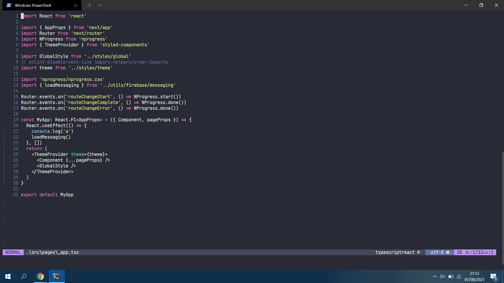

<h1 align="center">Neovim Config</h1>
<p align="center">


</p>
<hr>

<p align="justify">
Minhas configurações personalizadas do editor de texto via terminal Neovim, do qual possuo muito apreço pois foi minha primeira IDE, da qual utlizei ela bastante na programação em meu celular.
</p>
<p align="center">
  
</p>

## 📥 Instalação

Com o [NeoVim](https://neovim.io/), [Git](https://git-scm.com/) e [Curl](https://github.com/curl/curl) instalados, copie e cole o código abaixo no terminal:

```bash
curl -s https://raw.githubusercontent.com/gsbenevides2/neovim-config/main/install.sh | bash
```

## ⚙️ O que está configurado?
<p align="justify">
Vem configurado com <a href="https://github.com/neoclide/coc.nvim">Coc</a> para <a href="https://github.com/neoclide/coc-tsserver">Typescript</a>, <a href="https://github.com/neoclide/coc-eslint">EsLint</a> e <a href="https://github.com/neoclide/coc-json">JSON</a>. Ele também vem com <a href="https://github.com/skywind3000/vim-quickui">QuickUI</a> para fácilitar o uso. Mais outros plugins parecidos, como <a href="https://github.com/dracula/vim">Dracula</a> para facilitar o desenvolvimento. Confira a lista de plugins <a href="https://github.com/gsbenevides2/neovim-config/blob/main/pluginList.vim">aqui</a>, lembrando que eles são instalados automaticamente através do <a href="https://github.com/junegunn/vim-plug">Vim-Plug</a>.
</p>

## 📝 Contribuições e Licença
<p align="justify">
Você pode usar e modificar estas configurações para seu uso pessoal. No entanto, o envio de pull requests para este repositório não é permitido. Mas caso tenha uma sugestão de plugin o configuração que todos deviam saber, fique à vontade para abrir uma issue. Este projeto esta sobre a licença do  <a href="LICENSE">MIT</a>.
</p>

## 🗑 Desinstalar
<p>
Fico triste em saber que você deseja desinstalar meu conjunto de configurações do NeoVim. Lembre-se de que a guia de problemas está aberta para contribuições e melhorias. Para desinstalar, execute o comando abaixo:
</p>

```bash
rm ~/.config/nvim ~/config/coc ~/.local/shared/nvim -rf
```

> <p align="justify">Aviso: O comando acima irá redefinir seu NeoVim completamente junto com quaisquer personalizações que você tenha feito. Eu recomendo fazer backup se você fez alguma personalização.</p>

<hr>
<p align="center">Feito com 🤍 por<a href="https://gui.dev.br"> Gsbenevides2</a></p>
